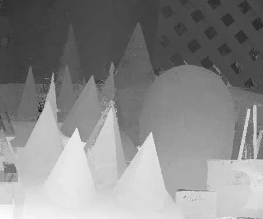

# paperwithcode
reproduce papers

## Paper List

MLPnP: 
Urban S, Leitloff J, Hinz S. Mlpnp-a real-time maximum likelihood solution to the perspective-n-point problem[J]. arXiv preprint arXiv:1607.08112, 2016.

test data from [middlebury](https://vision.middlebury.edu/stereo/data/scenes2003/)

result

PatchMatch Stereo:
Bleyer M, Rhemann C, Rother C. PatchMatch Stereo-Stereo Matching with Slanted Support Windows[C]//Bmvc. 2011, 11: 1-11.

### TODO

Weighted Median Filter替换PatchMatch Stereo中使用的Weighted Median Filter:
Ma Z, He K, Wei Y, et al. Constant time weighted median filtering for stereo matching and beyond[C]//Proceedings of the IEEE International Conference on Computer Vision. 2013: 49-56.

PatchMatch Stereo 并行加速

[RANSAC](http://cmp.felk.cvut.cz/cvpr2020-ransac-tutorial/)

Xu Q, Tao W. Multi-scale geometric consistency guided multi-view stereo[C]//Proceedings of the IEEE/CVF Conference on Computer Vision and Pattern Recognition. 2019: 5483-5492.